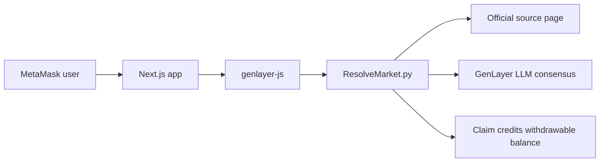

# Resolve

Resolve is a hackathon-ready curated prediction market on GenLayer: users connect MetaMask, get testnet GEN, stake Yes or No on owner-created markets, wait for the deadline, trigger onchain resolution from an official public webpage, and claim pro-rata winnings.



## Prerequisites

- Node.js 20+
- npm
- MetaMask
- GenLayer CLI / Studio
- Testnet GEN from the selected network faucet

## Run locally

```bash
npm install
cp .env.example .env.local
npm run dev
```

Open `http://localhost:3000`. The homepage renders a friendly missing-contract state until `NEXT_PUBLIC_CONTRACT_ADDRESS` is set.

## Deploy contract

See `deploy/README.md` for Studionet and Testnet Bradbury commands. The single contract source is `contracts/ResolveMarket.py`; it holds all market, stake, claim, and resolution state. The included contract is pinned to the older v0.2.16 Studio runtime and the frontend defaults to Studionet.

## Configure frontend

Set these in `.env.local` for local use and in Vercel for hosted demos:

```bash
NEXT_PUBLIC_CONTRACT_ADDRESS=0x...
NEXT_PUBLIC_NETWORK=studionet
NEXT_PUBLIC_CHAIN_ID=61999
NEXT_PUBLIC_RPC_URL=https://studio.genlayer.com/api
NEXT_PUBLIC_EXPLORER_URL=
NEXT_PUBLIC_FAUCET_URL=https://testnet-faucet.genlayer.foundation
NEXT_PUBLIC_OWNER_ADDRESS=0x...
```

## Deploy Vercel

```bash
npm install
npm run build
```

Import the repo in Vercel, add the environment variables above, and deploy. No backend server, database, or API routes are required.

## How resolution works

After the deadline, anyone can call `resolve(market_id)`. The contract renders `source_url` in text mode, prompts an LLM to return JSON only, and asks validators to accept the leader result only when the extracted winner is structurally valid and agrees with their own source-grounded extraction. If the page is inconclusive, winner `0` raises `event not clearly finished on source page` and the market remains unresolved.

Payouts use the schema-safe withdrawable balance path in this repo. Stakes enter through the legacy `@gl.public.write` payable method, `claim(market_id)` computes the pro-rata amount and credits `withdrawable[user]`, and `withdraw()` clears and returns that amount for the demo UI. GenLayer's documented native transfer pattern uses an EVM recipient interface with `emit_transfer(value=amount)`; that interface was intentionally left out because the current Studio schema loader in this environment rejected contracts before schema generation when helper interfaces were present.

## Test plan

- `npm run typecheck`
- `npm run build`
- Deploy to Studionet, set env, and confirm homepage lists markets.
- Connect MetaMask and switch/add the configured GenLayer network.
- Create a market from `/admin` with the owner wallet.
- Stake Yes and No from two wallets before the deadline.
- Resolve too early and confirm the UI shows a human error.
- Resolve an inconclusive page and confirm the market stays unresolved.
- Resolve a finished event and claim from the winning wallet.
- Cancel an unresolved market and confirm both sides can reclaim principal.

## Demo seeds

1. Finished or soon-to-finish sports match: use an official ESPN, BBC Sport, league, or tournament match page with Yes/No labels matching the two teams.
2. Announcement market: "Has X been announced on this official page?" using an official blog, changelog, or newsroom URL.
3. Upcoming unresolved event: use a future official event page so `resolve` returns winner `0` and the UI can show "event not finished."

Do not scrape or hardcode article text. Store only public URLs; the contract stores the short excerpt produced during resolution.

## Known limitations

- V1 is owner-curated. There is no public market factory.
- There is no AMM, order book, share token, leverage, or limit order system.
- The frontend estimates fees per write for hackathon clarity. Production apps should profile writes and use checked-in fee profiles or Transaction Kit.
- Network IDs and explorer URLs may change; keep `.env.local` aligned with current GenLayer docs.
- This is testnet-only software and not a real-money gambling product.

## Two-minute judging path

1. Open the live site and connect MetaMask.
2. Use the faucet CTA to get testnet GEN if needed.
3. Open a market, stake on one side, and watch the transaction stepper.
4. Open an expired market and click Resolve.
5. Read the stored excerpt, then claim winnings from a winning wallet.
